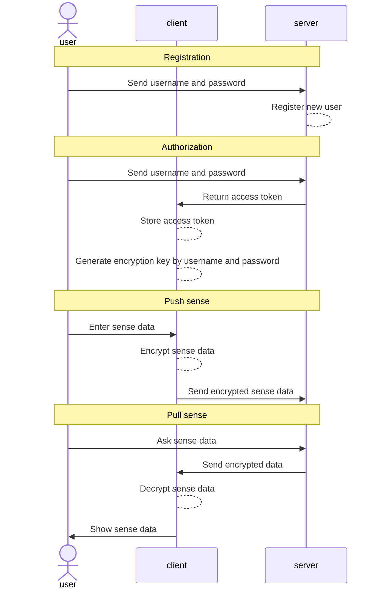

# Soul Diary

## User Flow

### Soul Diary Server

```mermaid
sequenceDiagram
  actor user
  participant client
  participant server
  Note over user,server: Registration
  user->>server: Send username and password
  server-->server: Register new user
  Note over user,server: Authorization
  user->>server: Send username and password
  server->>client: Return access token
  client-->client: Store access token
  client-->client: Generate encryption key by username and password
  Note over user,server: Push sense
  user->>client: Enter sense data
  client-->client: Encrypt sense data
  client->>server: Send encrypted sense data
  Note over user,server: Pull sense
  user->>server: Ask sense data
  server->>client: Send encrypted data
  client-->client: Decrypt sense data
  client->>user: Show sense data
```
